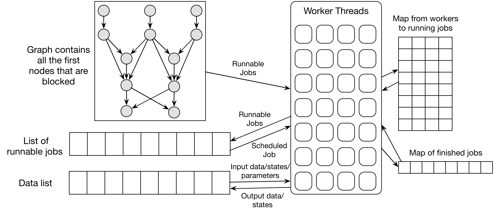
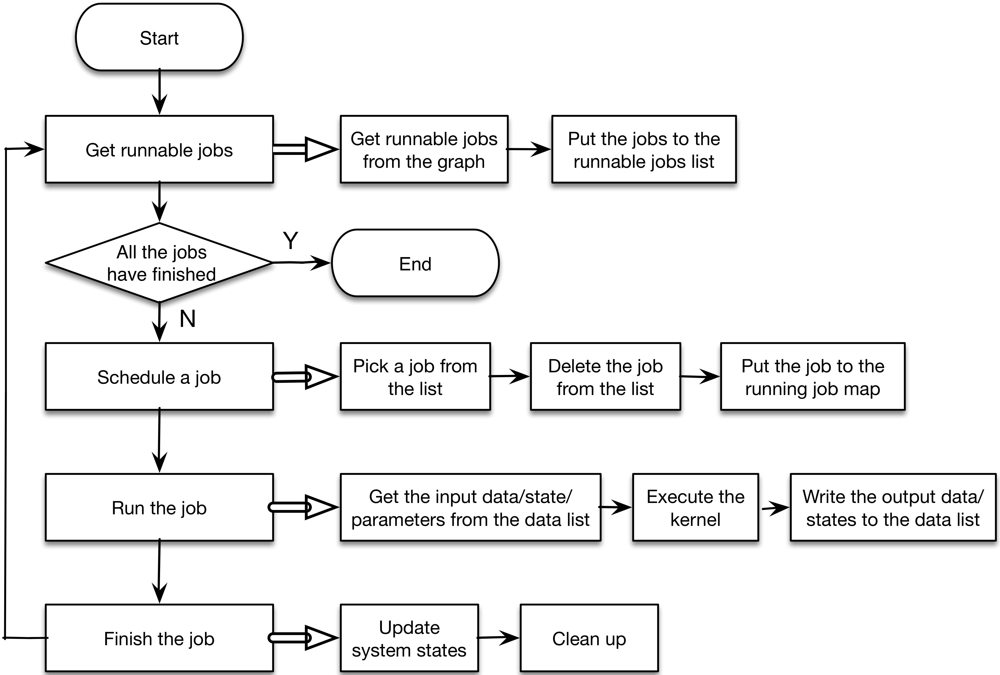
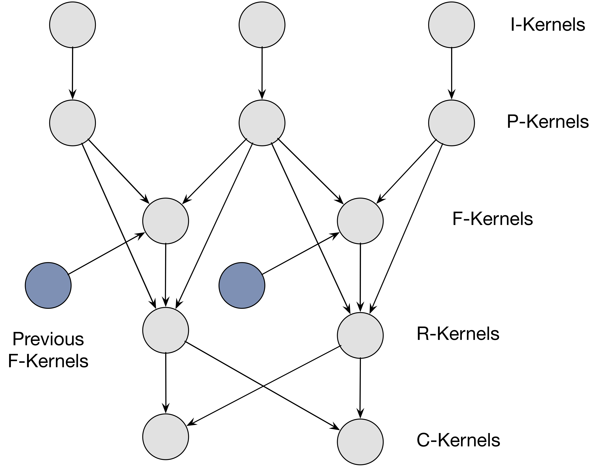
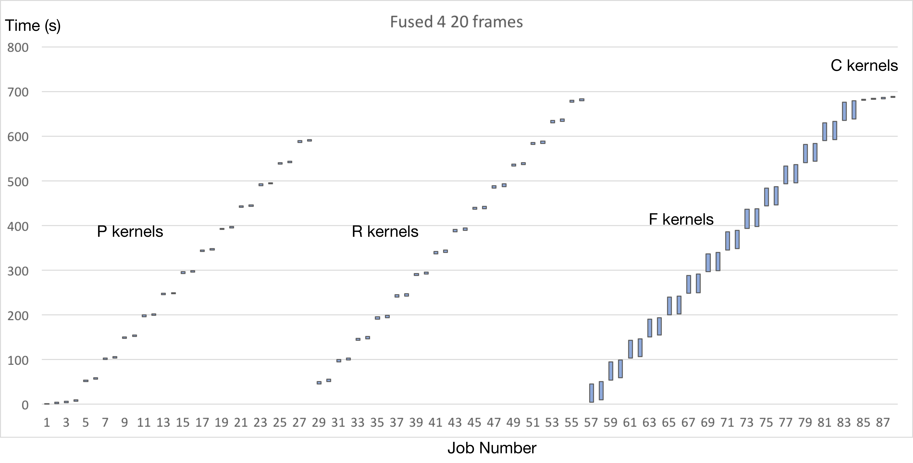
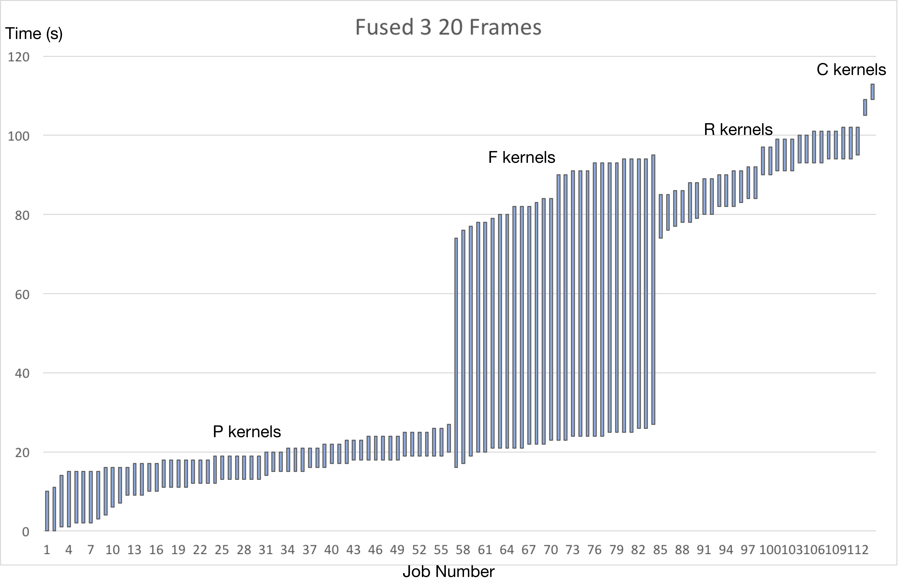
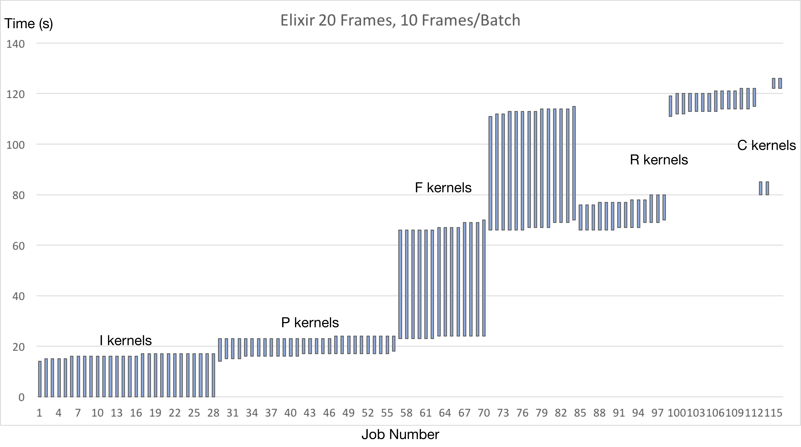

## Summery

Elixir is a scheduling framework for video processing pipelines. It runs on 
parallel machines with multiple CPU cores and hyperthreads. The main goal of our 
project is to achieve a speedup, compared against the original scheduler running 
on [Scanner](https://github.com/scanner-research/scanner).

The code combined with Surround360 application can be found in the 
[Surround360](https://github.com/albusshin/Surround360) repository.

## Background and Challenges

Many researches were conducted on scheduling policies on parallel machines. 
Given the model, the problem of achieving the optimal performance is 
NP-Hard[^1]. Hence, the first and biggest challenge for this project was to 
extract the features of classic video processing applications, and apply the 
effective and efficient heuristics on the scheduling policies.

Secondly, a scheduler should also be able to quickly decide which job to run 
when being asked. The policy should be simple enough, yet efficient for 
resources usage.

Last but not least, the implementation of the scheduler should be efficient 
while running on parallel machines. The overhead introduced by the scheduler 
should be as small as possible. This includes using the correct synchronization 
primitives, using the caches more efficiently, etc.

## Approach

### Abstraction of Video Processing in the Framework

The process of video processing can be abstracted into a Directed Acyclic Graph. 
In our framework, we see one portion of computation for one frame or a batch of
frames as a job which is a vertex in the graph. Each job has their own input 
data and output data. The input data may come from the original video frame, the 
output of a job in the same frame or the output of a job in a previous frame. 
The data dependency between different nodes can be seen as the edges in the 
Graph. And since there is data dependency, one job will be blocked until all 
input data is available. 

### System Architecture

The system design of our scheduler is shown in the figure above.

There is a graph which represents the data dependencies between different jobs. 
The graph is specific to the application the scheduler is running on and can be 
load by the customer by an API we provided. Each node in the graph stores the 
node ID, batch sequence number and the dependencies between other nodes. During
the scheduling process, the batch sequence number is the first job in the 
sequence that is blocked.
 
There is a job queue which stores all the runnable jobs in the system. Each job 
is assigned a priority according to certain properties. Whenever a job needs 
to run, the priorities of all the jobs in the queue will be re-computed and the 
job with the highest priority will be chosen and scheduled. The specific policy 
will be introduced in a "Scheduling Policies" Session. 

There is also a data list which stores temporary results produced by the 
workers. When all of the children dependencies of a node are met, the output 
data of the certain node will be deleted from the data list, since no other jobs 
will be using this data.

Finally, there are several worker threads which obtains jobs from the job queue
to run. For each cycle in a worker thread, it will first ask for a job from the 
priority job queue and run the job on the thread. After the job finishes, the 
state of graph as well as the system is updated and new runnable jobs will be 
put into the runnable job queue. Below is the detailed control flow of our worker 
threads.

### Scheduling Policies

Two policies are implemented in our system. One if implements a 
First-in-first-out (FIFO) policy, the other implements a policy that we 
specifically designed for video processing. Also, a user can implement his/her 
customized policy in the our framework and use it for scheduling.

Our specifically designed policy considers a set of properties of one job and 
calculates a priority based on those properties. The job with the highest 
priority will be selected from the runnable job queue and scheduled on a certain
worker thread.

The properties that our policy considers are:

* The batch sequence ID of the job:
    
    The job with the smaller batch sequence ID should be run earlier so that if 
    a job has data dependency on a previous frame, the job with larger sequence
    ID won't be blocked.
    
* The depth of the job in the graph:

    The job shallower in the graph should be run earlier so that the job's 
    children dependencies won't be blocked.

* Data locality (producer-consumer locality):
    
    The job that needs certain input data should preferred to be scheduled on 
    the same worker thread that executes the jobs that produce the data. 

* The number of child dependency of the job:

    The job with more children dependencies should be scheduled first so that 
    less jobs will be blocked.

In our policy, we consider each property as the sequence in the above list. We 
first find the jobs with the smallest batch sequence ID. In the subset, we find
the jobs with the smallest depth in which we find the jobs that can satisfy data
locality in which we find the jobs with largest number of children dependencies.
If there is only one job left, the job will be scheduled. Otherwise, we will 
schedule final job list by the order of adding time.

## Results with respect to Scanner

We achieved a **6.15x speedup** was achieved when running Surround360 pipeline
 on our scheduling policy comparing that of Scanner's.

### The Application: Surround360 by Facebook
We used the [Surround360](https://github.com/albusshin/Surround360) video 
processing application for the following analysis. The application provides 
the most complex workflow pipeline amongst all the applications written with 
Scanner, and the opportunities for parallelism are abundant.

As shown in the Pipeline figure above, the pipeline of Surround360 is consisted 
of 5 layers of kernels: I, P, F, R and C. The dependencies between the kernels 
and layers of kernels can be expressed as a DAG: the nodes representing the 
minimal granularity of jobs that need to be done, and the edges representing the
dependencies, or data flows, between the jobs. Our job then, is to operate on 
the DAG and choose an efficient scheduling policy such that the C kernels 
(the last layer of the kernels) can be finished as early as possible.

The figure above is a subsection of a flatten version of the first figure. In 
total, there are 14 of I kernels, 14 of P kernels, 14 of F kernels, 14 of R 
kernels, and 2 of C kernels. The data flows from I kernels into the whole DAG, 
and the output is generated by the 2 C kernels. To better understand how the 
data flows inside the DAG, consider one frame of 14 videos generated by the 
Facebook Surround360 Camera: the camera has 14 cameras on the side. Each frame 
generated by the 14 cameras follows into the corresponding I kernels of the 
pipeline, and then flows into the corresponding P kernel underneath it, to 
generate a projected spherical frame; and then the projected frame flows into 
the left and right F kernels underneath it, generating the left and right 
optical flows, which in turn flow into the R kernels, generating the overlapped 
regions in the panorama image, which are consumed by the 2 C kernels generating 
panorama images for both left eye and right eye.

One important thing to notice for this workflow is, the workflow of the F 
kernels is serial. That is, F kernels for a single camera cannot be executed 
in parallel. This is because there exist dependencies between each layer of the 
F kernel: a next layer of the F kernel needs to use the output from the previous 
layer.

Given this complex workflow pipeline, we optimized our scheduling policy and 
achieved a reasonable speedup.

### Results

We ran our experiments on an AWS c4.8xlarge instance, with 16 cores with 
hyperthreading (32 vCPUs) and 244GB of Memory.

We introduce 1 baseline and 1 optimal objective here to reference the 
performance of our scheduler to. We ran a processing job of 20 frames from the 
video dataset, with each batch (layer) containing 10 frames to process.

#### Baseline: Scanner

The first baseline introduced here is running this pipeline on Scanner.

Running 20 frames used 715.42 seconds in total, and running the kernels alone 
(excluding the overheads and loading data from DB) used 689 seconds.

The following figure shows how much time each kernel are count for.

#### Objective: Scanner with hand-tuned scheduling policy

The second baseline is running this pipeline with hand-tuned scheduling policy. 
We feed Scanner the jobs to run based on our pre-known knowledge about the 
graph, in a fashion that it can achieve the optimal performance.

Running 20 frames used 144.26 seconds in total, and running the kernels alone 
(excluding the overheads and loading data from DB) used 114 seconds.

The following figure shows how much time each kernel are count for.

#### Elixir Results

The results we achieved on running the kernels on Elixir achieved the following
 results.

Running 20 frames used 126 seconds in total, and running the kernels alone 
(excluding the I kernels running time) used 112 seconds.

Figure 5 shows how much time each kernel are count for.

This achieved a **689 / 112 = 6.15x speedup**

#### Speedup explained

The first reason of achieving this speedup is utilizing the fact that there are 
a lot of parallelism opportunities in this workflow pipeline.

Secondly, as we can see from the figures above, the F kernels are always using 
up most of the time for doing the computations, and it is the serialized part of
the whole pipeline. According to Amdahl's law, the best case we can achieve is 
to use the computation time for F kernels to hide all the computation time spent
in the other kernels, which is exactly what we did according to our scheduling 
policy.

### References

[^1]: Kwok, Yu-Kwong, and Ishfaq Ahmad. "Static scheduling algorithms for 
allocating directed task graphs to multiprocessors." ACM Computing Surveys 
(CSUR) 31.4 (1999): 406-471.

